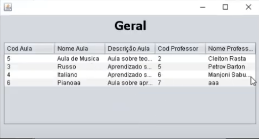
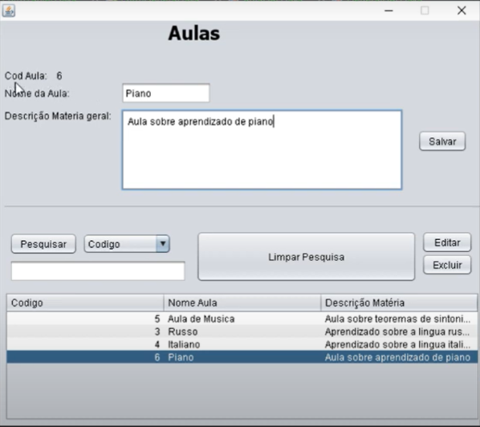
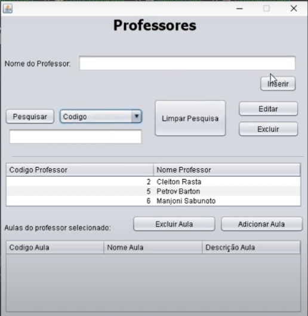

# College 📚

* Geral

* Aulas

* Professores

# Sobre 🔍

Aplicativo desenvolvido em Java com interface básica e banco de dados sql local, o objetivo da aplicação é ter um controle entre aulas e professores de um colégio.

# Tecnologia 👨‍💻

* Java ☕
